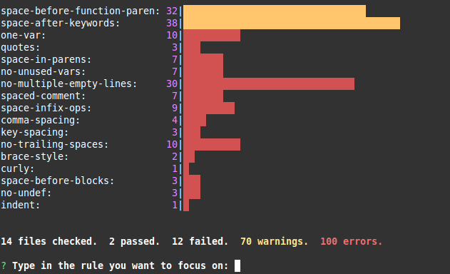
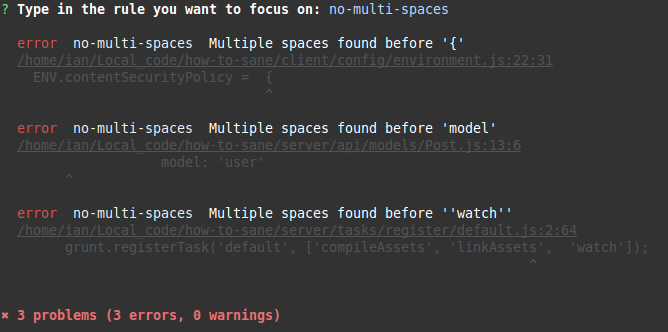

# eslint-nibble

[![npm][npm-badge]][npm-badge-url]
[![Build Status][travis-badge]][travis-badge-url]

Sometimes running ESLint against an existing project and fixing the hundreds or thousands of errors is biting off more than you can chew.  
Instead, `eslint-nibble` will give a quick overview of your failing rules, and then show the detailed error reports for one rule at a time.

If a rule can be automatically fixed by ESLint, `eslint-nibble` will allow you to run autofix on individual rules, allowing you to make more focused commits.

Read this excellent blog post from [Paul Hands](https://github.com/paulhands) for a clear explanation of what eslint-nibble can do for your project: [Hiring a gardener to trim the weeds](https://medium.com/@paul.hands.phd/hiring-a-gardener-to-trim-the-weeds-adding-a-linter-halfway-through-building-an-application-194c527db151).

## Installation

```bash
npm install --no-save eslint-nibble
```

You can also install `eslint-nibble` globally, but it is not recommended.

Instead, try installing `eslint-nibble` in your project with `--no-save` (as shown above), because this tool is intended only to get you up and running.  Once you're happy with your rules and your code, you can remove `eslint-nibble`.

Note: as of version `5.0.0`, `eslint-nibble` no longer comes with its own bundled version of `eslint`.  Instead, you should install `eslint` into your project (see [getting started](https://eslint.org/docs/user-guide/getting-started)), and `eslint-nibble` will use the version you install.  

This module does not make any decisions about which ESLint rules to run.  Make sure your project has an `.eslintrc` file if you want ESLint to do anything.  No linting rules are enabled by default.


## Usage

There are a few methods you can use to run `eslint-nibble`, depending on the package manager you are using.

### npx

If you're using `npm@5.2.0` or later, you can simply run:

```bash
npx eslint-nibble <directories and files to lint>
```

### yarn

Similarly, if you are using yarn, you can run:

```bash
yarn eslint-nibble <directories and files to lint>
```

### package.json script

Add something like the following to your `package.json` file:

```json
"scripts": {
  "nibble": "eslint-nibble <directories and files to lint>"
}
```

Then, to run eslint-nibble, you can use:

```bash
npm run nibble
```

Eslint-nibble will then display a rundown of the rules that are failing and a summary of the results, 
using [eslint-stats](https://github.com/ganimomer/eslint-stats) 
and [eslint-summary](https://github.com/davidwaterston/eslint-summary), and will ask you to pick a rule to work on:



Select one of the rules by arrowing up/down and pressing `enter`.  
If the rule can be fixed automatically, ESLint will ask if you'd like it to attempt perform fixes for you.
If there are lint warnings, you will also be asked whether you want those to be auto-fixed.


If you decide not to make autofixes, or the autofix completes but cannot fix all the errors, then a detailed list of the errors will be presented, using [eslint-friendly-formatter](https://github.com/royriojas/eslint-friendly-formatter).  
If you are using iTerm2 or Guake, you can set them up so that your text editor opens to the correct line when you click on the filename.



## Options

### `--config, -c`

ESLint will automatically detect config files with [standard naming](http://eslint.org/docs/user-guide/configuring#configuration-file-formats).
Add the `--config` option to specify a different config file for ESLint to use.

### `--cache`

Highly recommended.  ESLint will cache the results of linting, causing subsequent runs to be much faster.  See the
[ESLint docs](https://eslint.org/docs/user-guide/command-line-interface#--cache) for more details.

### `--cache-location`
When used in conjunction with the `--cache` flag, controls where the ESLint cache
is written.  See the [ESLint docs](https://eslint.org/docs/user-guide/command-line-interface#--cache-location)
for more details.

### `--ext`

If your Javascript files have an extension other than `.js`, you can use the `--ext` flag to
specify which extensions to examine.  For example, this will check all files ending in `.jsx` or `.js`:

```shell
eslint-nibble --ext .jsx,.js lib/
```

### `--format, -f`
When used in conjunction with `--no-interactive`, controlls the output [format from ESLint](https://eslint.org/docs/user-guide/formatters).  Has no effect in interactive mode.  The default ESLint formatter will be used if `--format` is not set.

### `--fixable-only`
Only show rules that are autofixable.


### `--multi`
Allows selection of more than one rule at a time in the interactive cli.

### `--no-interactive`
Potentially useful in CI, or any other situation where you would like to run ESLint using your standard project config (`.eslintrc`), but only on a subset of rules (using the `--rule` flag).  Using `--no-interactive` will prevent eslint-nibble from displaying a menu, but will instead print out any warnings/errors and return an exit code of 1 if there are errors, or 0 otherwise, just like ESLint itself does.

### `--no-warnings`
Only show results for linting errors, not warnings.

### `--resolve-plugins-relative-to`

Changes the folder where plugins are resolved from.  See the
[ESLint docs](https://eslint.org/docs/user-guide/command-line-interface#--resolve-plugins-relative-to)
for more details.

### `--rule`
If you have so many failing rules that navigating the list is cumbersome, use this flag to filter down
the rules that are displayed.  Multiple rules can be included as comma-separated strings (e.g. `--rule semi,quotes`),
or by using multiple `--rule` flags (e.g. `--rule semi --rule quotes`).

### `--rulesdir`
This corresponds to the eslint `--rulesdir` [option](https://eslint.org/docs/user-guide/command-line-interface#-rulesdir).  Use it to specify a path to custom eslint rules.


### globs

You are not limited to directory and file names as arguments, you can also specify a glob pattern.
For example, to examine all `*.jsx` files in all `test/` directories under `lib/`:

```shell
eslint-nibble lib/**/test/**/*.jsx
```

[npm-badge]: https://img.shields.io/npm/v/eslint-nibble.svg
[npm-badge-url]: https://www.npmjs.com/package/eslint-nibble
[travis-badge]: https://travis-ci.org/IanVS/eslint-nibble.svg?branch=master
[travis-badge-url]: https://travis-ci.org/IanVS/eslint-nibble
