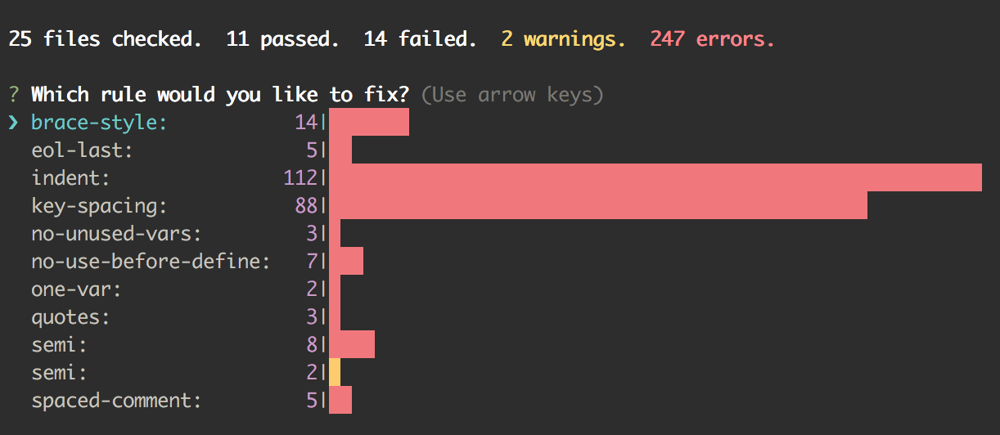

# eslint-nibble

[![npm][npm-badge]][npm-badge-url]
[![Build Status][travis-badge]][travis-badge-url]

Sometimes running ESLint against an existing project and fixing the hundreds or thousands of errors is biting off more than you can chew.  
This will give a quick overview of your failing rules, and then show the detailed error reports for one rule at a time.

If a rule is able to be automatically fixed by ESLint, `eslint-nibble` will allow you to run autofix on individual rules, allowing you to make more focused commits.

Major versions of this tool correspond to the major version of ESLint.  This means eslint-nibble version `4.X` will use the latest eslint `4.X`.

## Installation

```bash
npm install eslint-nibble
```

You can also install `eslint-nibble` globally, but it is not recommended.

Instead, try installing `eslint-nibble` in your project without `--save-dev` (as shown above), because this tool is intended only to get you up and running.  Once you're happy with your rules and your code, install eslint itself with `npm install eslint --save-dev`, and use that for all your ongoing linting.


## Usage

Add something like the following to your `package.json` file:

```json
"scripts": {
  "nibble": "eslint-nibble lib/ tests/ index.js"
}
```

This will run eslint against `*.js` files in the `lib/` and `tests/` directories, as well as `index.js`.

Then, to run eslint-nibble, you can use:

```bash
npm run nibble
```

Eslint-nibble will then display a rundown of the rules that are failing and a summary of the results, 
using [eslint-stats](https://github.com/ganimomer/eslint-stats) 
and [eslint-summary](https://github.com/davidwaterston/eslint-summary), and will ask you to pick a rule to work on:



Select one of the rules by arrowing up/down and pressing `enter`.  
If the rule can be fixed automatically, ESLint will ask if you'd like it to attempt perform fixes for you.
If there are lint warnings, you will also be asked whether you want those to be auto-fixed.


If you decide not to make autofixes, or the autofix completes but cannot fix all the errors, then a detailed list of the errors will be presented, using [eslint-friendly-formatter](https://github.com/royriojas/eslint-friendly-formatter).  
If you are using iTerm2 or Guake, you can set them up so that your text editor opens to the correct line when you click on the filename.


## Options

### `--ext`

If your Javascript files have an extension other than `.js`, you can use the `--ext` flag to
specify which extensions to examine.  For example, this will check all files ending in `.jsx` or `.js`:

```shell
eslint-nibble --ext .jsx,.js lib/
```

### `--config`

ESLint will automatically detect config files with [standard naming](http://eslint.org/docs/user-guide/configuring#configuration-file-formats).
Add the `--config` option to specify a different config file for ESLint to use.

### globs

You are not limited to directory and file names as arguments, you can also specify a glob pattern.
For example, to examine all `*.jsx` files in all `test/` directories under `lib/`:

```shell
eslint-nibble lib/**/test/**/*.jsx
```


## Notes

This module does not make any decisions about which ESLint rules to run.  Make sure your project has an `.eslintrc` file if you want ESLint to do anything.  As of version 1.0.0, no rules are enabled by default.

[npm-badge]: https://img.shields.io/npm/v/eslint-nibble.svg
[npm-badge-url]: https://www.npmjs.com/package/eslint-nibble
[travis-badge]: https://travis-ci.org/IanVS/eslint-nibble.svg?branch=master
[travis-badge-url]: https://travis-ci.org/IanVS/eslint-nibble
